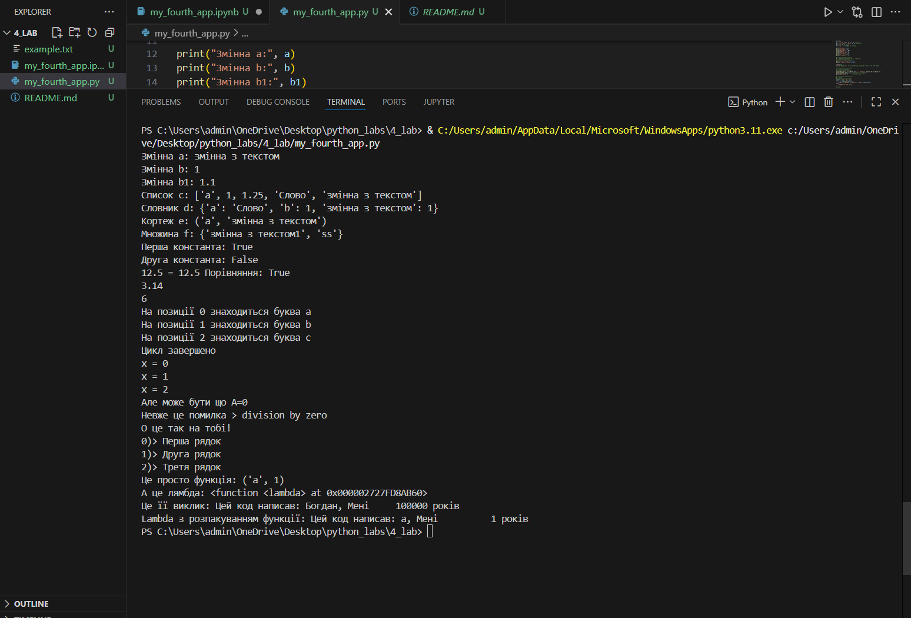

# Основи програмування на Python
## Мета роботи: Навчитись застосовувати основні конструкції мови Python, виконати всі приклади та з використанням AI створити власні приклади які демонструють особливості кодових конструкцій Pyhton

---
### Виконання роботи
* Результати виконання завдання 1–8;
1. Ознайомились з основними типами даних у Python: str, int, float, list, tuple, dict, set.
2. Виконано приклади роботи з константами та ключовими словами Python.
3. Вивчено роботу вбудованих функцій: abs(), len(), round().
4. Реалізовано приклади циклів for та while.
5. Написано код з розгалуженнями if-elif-else.
6. Виконано обробку помилок з try-except-finally.
7. Попрацювали з контекст-менеджером with для роботи з файлами.
8. Створено приклади функцій та lambda-функцій.

### Висновок:
> у висновку потрібно відповісти на запитання:
- :question: Що зроблено в роботі; 
Опановано основні конструкції Python, виконано приклади коду та практичні завдання.

- :question: Чи досягнуто мети роботи;  
Так, мета досягнута – отримано базові навички програмування на Python.

- :question: Які нові знання отримано;  
Типи даних, цикли, розгалуження, обробка помилок, контекст-менеджери, функції та lambda.

- :question: Чи вдалось відповісти на всі питання задані в ході роботи;  
Так, усі приклади виконано та пояснено.

- :question: Чи вдалося виконати всі завдання; 
Так, всі завдання завершено успішно.

- :question: Чи виникли складності у виконанні завдання; 
Невеликі труднощі з контекст-менеджером при роботі з файлами.

- :question: Чи подобається такий формат здачі роботи (Feedback);  
Так, Markdown зручно структурує звіт, легко додавати код та скріншоти.
