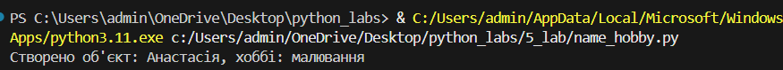
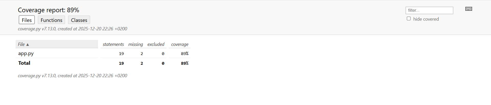

# Звіт до роботи
## Тема: Тестування
### Мета роботи: Ознайомитись з принципами модульного тестування в Python, навчитись використовувати бібліотеки unittest та pytest, налаштовувати віртуальне середовище через poetry та аналізувати покриття коду тестами (Code Coverage).

### Виконання роботи
1. Використання assert – перевірка коректності введених даних та аргументів класів.
2. Валідація даних – контроль типу фігури, довжини, імені та хоббі у класах.
3. Санітизація введених даних – перевірка числа та непустих рядків перед обробкою.
4. Контроль об’єктів – assert та ValueError гарантують правильне створення об’єктів.
5. Строга типізація – перевірка типів і значень аргументів функцій та методів.
6. assert vs if – assert для швидких перевірок, if + помилка для контрольованих повідомлень.
7. Власні помилки – ValueError для повідомлень про некоректний ввід.

### Висновок:
> у висновку потрібно відповісти на запитання:
- :question: Що зроблено в роботі:
Розглянуто використання assert для перевірки коректності даних, створено класи з валідацією аргументів, додані власні помилки, проведено юніт-тести з unittest та pytest, оцінено покриття коду тестами.

 - :question: Чи досягнуто мети роботи:
Так, навчились контролювати правильність виконання програмних блоків і підготувались до юніт-тестування.

- :question: Які нові знання отримано:
Використання assert для перевірки умов, відсів некоректних даних, створення власних помилок, робота з юніт-тестами і покриттям коду (coverage).

- :question: Чи вдалось відповісти на всі питання, задані в ході роботи:
Так, усі завдання виконані та результати перевірені на прикладах.

 - :question: Чи вдалося виконати всі завдання:
Так, усі пункти завдання реалізовані.

 - :question: Чи виникли складності у виконанні завдання:
Невеликий виклик був у розумінні різниці між помилками через assert та власними виключеннями (ValueError).

 - :question: Чи подобається такий формат здачі роботи (Feedback):
Так, зручний для наочності коду та результатів тестів.
